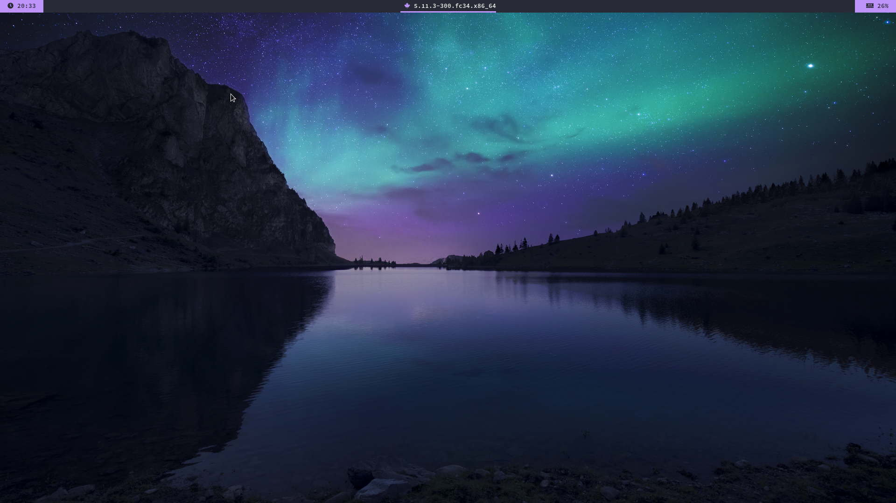

# ~~Orange Forest~~ Dracula Mountain

Dracula Mountain is a modification of the Orange Forest theme.
## Screenshot



## Dependencies

- [leftwm](https://github.com/leftwm/leftwm)
- [picom](https://github.com/yshui/picom)
- [polybar](https://github.com/polybar/polybar)
- [font awesome(free)](https://github.com/FortAwesome/Font-Awesome)
- [source code pro font](https://github.com/adobe-fonts/source-code-pro)

## Installation

1. Install all required dependencies (required font ttf files can be added in ~/.fonts/)
2. Make a copy of this project in your themes folder

```BASH
cp -r ./leftwm-theme-dracula-mountain ~/.config/leftwm/themes
```

3. Remove the symlink to your current theme if set

```BASH
rm ~/.config/leftwm/themes/current
```
4. Set this as your current theme

```BASH
ln -s ~/.config/leftwm/themes/leftwm-theme-dracula-mountain ~/.config/leftwm/themes/current
```

5. Restart your window manager

```Default shortcut
$MOD + Shift + r
```
# Extra
The [dracula](https://draculatheme.com/) has plenty of themes like these for other programs.
## Credits

[Orange Forest](https://github.com/PVautour/leftwm-theme-orange-forest/tree/cb951ec2d31f6a72a4783f336a263678ba9b8a81)
